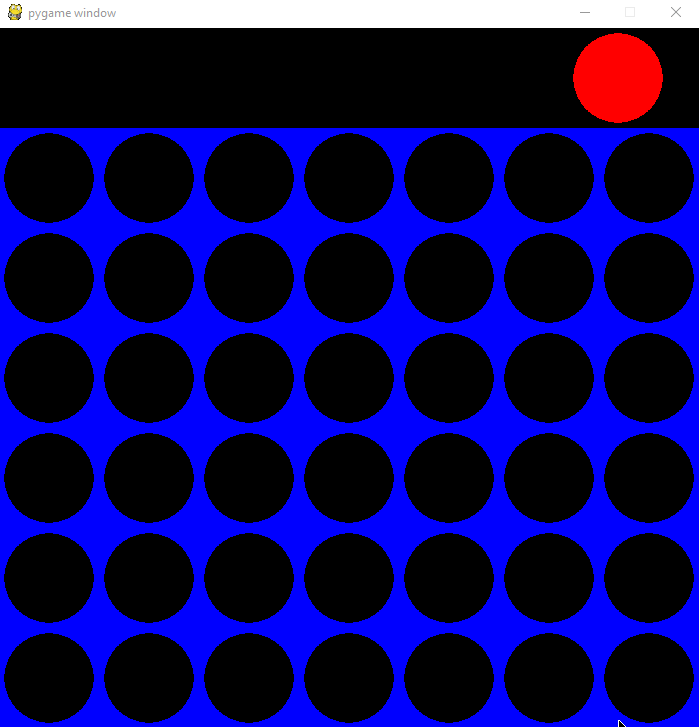

# PythonConnectFour

A Connect Four game written in Python3 for two players.

## Getting Started

Before you clone the repository you first want to make sure you have Python3. Also make sure you have pygame installed as well.

`pip3 install pygame`

Once pygame is downloaded you can then clone.

`git clone https://github.com/Googlymonster/PythonConnectFour.git`

To run the game enter the following code in the terminal.

`python3 connect4.py`

Each player takes turns dropping a piece into a column by hovering over the mouse and pressing down to drop a tile.

### Have Fun

